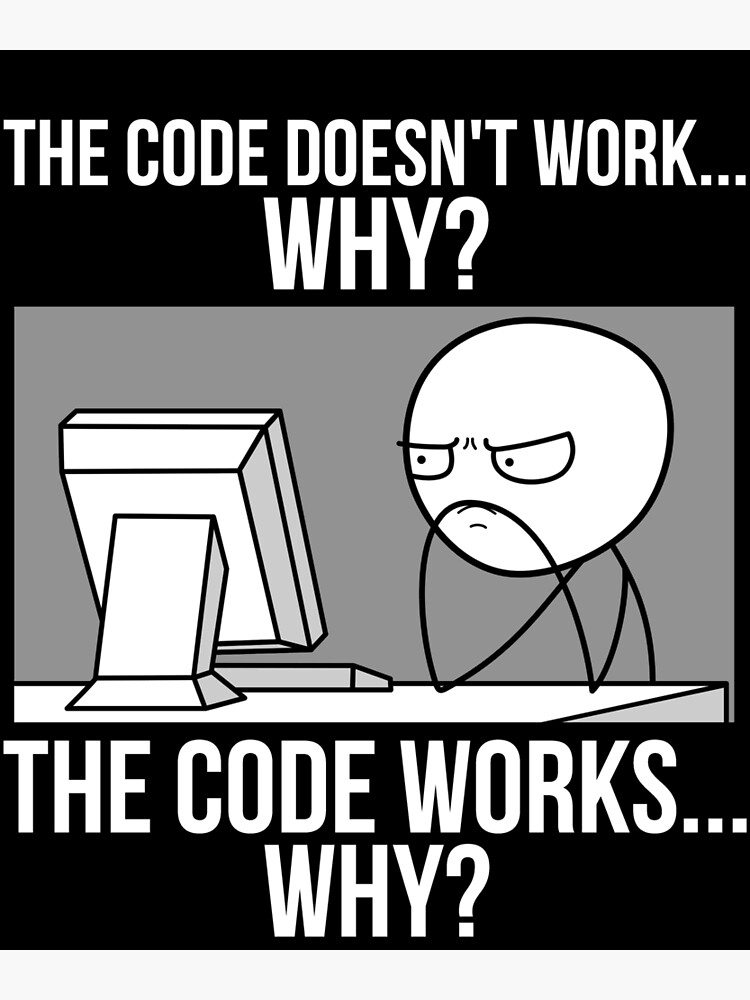

# Step 1 - Task: Cleaner Tests Using APIs

[<Prev]() | [Main](../../README.md) | [Next>](./step2.md)

---

[TOC]



## Task

Test setup and takedown can take a while. And if there's a bug somewhere in the process, your test can fail, but NOT where you actually want to do your testing! It has been said that the more focused your tests are, the better. Scripting API calls into your tests leverages your application's API (where possible) to automate processes instead of using the UI:

-   Prevents "hidden bugs" or "defect masking" where an unrelated failure prevents discovery of a bug.
-   Speeds up tests by moving steps out of the UI.
-   Enables tests to focus on one thing at a time.
-   Simplifies tests -- frequently saving on maintenance costs even if there are MORE tests.

### Technical Acceptance Criteria

-   Your tests are more granular.
-   Your testing covers a broader number of possible inputs/permutations, leading to an even larger number of tests.
    -   Like creating movies with different date ranges, or varying numbers of cast members.
-   Your tests clean up after themselves:
    -   Added records are removed
    -   Preexisting records that are edited are returned to their original state
    -   Preexisting records that are removed are re-added
-   All of the above is accomplished leveraging the API with scripted calls.

**Please Note:** You do not need to refactor EVERY test this way (see _Stay Efficient_ below), but enough to show that you understand and can gain the benefits this type of automation can bring.

## General Instructions

It has also been said that a good automated test will take under a minute to run. You can make an exception for E2E testing (End-to-End, also known as/similar to Smoke/Sanity testing), but the bulk of our tests should be very quick to run, very targeted in what they're checking.

The more assertions we have, the more points of failure in our test, and the more likely we'll run into defect masking; i.e. a bug in the search screen preventing our automation from ever opening an item screen, where yet another bug remains unseen.

-   Consider the ways that your current tests cover more functionality than they need to.
    -   How many of your tests would fail/need maintenance if small parts of the application were updated, and/or had a bug introduced?
-   Would it be useful to check JUST the smaller pieces of the application?

### Example Old Test (Add and Remove Movie)

1. Sign in as Admin
1. Open the Entities > Movie page
1. Click Create New Movie
1. Populate the Movie Form
1. Click Save
1. Verify the new movie is present on the Entities > Movie page
1. Click that movie's Delete button
1. Confirm Deletion
1. Verify the deleted movie is not present on the Entities > Movie page

> **Follow-up Questions**
>
> -   How many points of failure exist in this test?
> -   How long would it take to execute?

### Example Cleaner Test(s)

**1. Sign In**
**1. Navigation**
**1. Movie Creation Screen**
**1. New Movies Displayed**
**1. Movie Deletion**
**1. Deletion Movies Not Displayed**

This is just an example of how you might break down your tests; you do you on how you want to break things down. The key factor is that you'll be breaking your tests into these chunks by leveraging the API.

-   The **Sign In** test would probably be the only one NOT using the API in some way/shape or form. You _can_ make this an API process for OTHER tests using third party libraries.
    -   Note: This is not required for this task, even if it's a good skill to have.
-   Ideally, even the **Navigation** test(s) are using the api to log in before testing different links to save time on loading the log-in page.
-   Movie Creation? This would use the API to verify the movie is in the list returned, as well as to delete the movie afterwards.
-   etc.

This leads to:

-   Cleaner/Faster/More Reliable Tests
    -   Tests become cheaper to run individually, and give more immediatley useful feedback
-   A cleaner test environment (better setup/teardown)
-   More to maintain (but not necessarily more time on maintenance when done right)

## Keep In Mind

> **Stay Efficient**
>
> We need to remember to keep our testing valuable. Taking the time to script the API calls and automate testing for EVERYTHING is not going to pay off in the long run. Reconsider this the same way you'd consider whether something should be automated in the first place:
>
> 1. Is it a risky area?
> 1. How often does it change that tests would need updating?
> 1. Will automating this save me time?
>
> After considering the basic automation questions (in the light of swapping to even MORE granular tests) there are a few more tha might be worth considering.
>
> 1. Is this functionality complicated enough to warrant a larger number of tests around it?
> 1. Is this functionality re-used enough to justify spending my time figuring it out in the API?

> **Authentication**
>
> Authentication can be a beast sometimes. In some instances it might prove too complicated to even TRY to stick all of your authentication into an API call; you may or may not have to deal with signing in for EVERY test. Just like mentioned above, remember to stay efficient.
>
> **Note:** For this application, the api returns a simple bearer token; you should be good to utilize that!

> **End to End Testing is Still Important**
>
> No matter how clean and effective your integration testing becomes using this methodology, full end to end test running against the UI remain effective and essential; both automated and manual. This testing just reduces the NUMBER of those tests needed, and enables us to run evem more combinations of inputs through the UI.

## API Documentation

For at least those requests needed for this task:

-   **API Base URL: `http://localhost:8080/api`**
-   **Authentication:** All endpoints other than `/authenticate` require the header **`Authentication="Bearer {bearerToken}"`** where `{bearerToken}` is the token returned from the `/authenticate` endpoint.

### Endpoints

#### /authenticate

-   **POST**
    -   Returns the bearer token for the provided user.
    -   **Body**:
        ```json
        {
            "username": "user",
            "password": "user",
            "rememberMe": false
        }
        ```

#### /movies

-   **POST**
    -   Creates a new movie.
    -   **Body**:
        ```json
        {
            "id": 1,
            "title": "Star Wars: Episode I - The Phantom Menace",
            "overview": "Once upon a time.",
            "releaseDate": "1999-05-16",
            "productionCompaniesId": "2",
            "productionCompaniesName": "Lucasfilm",
            "directors": [
                {
                    "id": 34
                }
            ],
            "casts": [
                {
                    "id": 116
                },
                {
                    "id": 164
                },
                {
                    "id": 149
                },
                {
                    "id": 46
                }
            ]
        }
        ```
-   **PUT**
    -   Edits an existing movie.
    -   **Body**: Same as **POST**
-   **GET**
    -   Returns all movie records.

#### /movies/{id}

-   **GET**
    -   Returns the movie with the given ID
-   **DELETE**
    -   Deletes the movie with the given ID

#### /people

-   **POST**
    -   Creates a new person.
    -   **Body**:
        ```json
        {
            "id": 1,
            "name": "Michael Curtiz",
            "birthday": "1886-12-24",
            "biography": "Lorem ipsum dolor sit amet, consectetur adipiscing elit, sed do eiusmod tempor incididunt ut labore et dolore magna aliqua.",
            "profilePath": "https://www.imdb.com/search/name/",
            "homepage": "https://www.imdb.com/search/name/",
            "alsoKnownAs": "no entry"
        }
        ```
-   **PUT**
    -   Edits an existing person.
    -   **Body**: Same as **POST**
-   **GET**
    -   Returns all person records.

#### /people/{id}

-   **GET**
    -   Returns the person with the given ID
-   **DELETE**
    -   Deletes the person with the given ID

#### /production-companies

-   **POST**
    -   Creates a new production company.
    -   **Body**:
        ```json
        {
            "id": 1,
            "name": "Alfred J. Hitchcock Productions",
            "logoImage": "someurl-1"
        }
        ```
-   **PUT**
    -   Edits an existing production company.
    -   **Body**: Same as **POST**
-   **GET**
    -   Returns all production company records.

#### /production-companies/{id}

-   **GET**
    -   Returns the production company with the given ID
-   **DELETE**
    -   Deletes the production company with the given ID

## General Links

-   [The Value of Mixing UI and API Testing](https://www.webomates.com/api-testing/the-value-of-mixing-ui-and-api-testing/)
