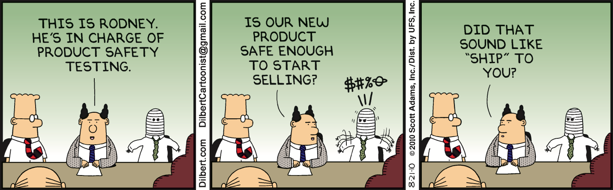

# Step 3 - Task: Reporting

[<Prev](./step2.md) | [Main](../../README.md) | [Next>](./step4.md)

---

[TOC]

## Task

What good are tests where the results go unnoticed, or misunderstood?

Find or create a tool to format your tests results into an easily understood/digestable format.

This might also motivate you/require you to reformat your testing to maximize usability.

### Technical Acceptance Criteria

-   You have implemented a tool (found or created) to output test results in an easy to understand format. Either:
    1. They could be emailed to and understood by a project manager.
    2. They could be consumed by a Test Case Management System (qTest, Zephyr, XRay, etc)
    3. They could be consumed by a CI/CD Pipeline
-   Your test naming is clear.
    -   Consistent naming scheme, results are easy to skim and find the test you want.
    -   Names are simple to understand, making implecations of a pass or failure readily understood.
-   You generate a single results file after each test run.

## General Instructions

Test results are vital! After all, QA is all about increasing our internal and external customers' confidence in our product, so being able to report good results is just as important as reporting the bugs.

Test results are used in a number of places and a number of ways:

1. Simple reports to stakeholders
2. Imported into test case management systems
3. Leveraged in CI/CD pipelines

For this exercise, your reports only need to satisfy one of those three requirements, but you will be required in a later exercise to execute your tests using a task runner as if they were in a CI/CD pipeline, so you may want to look ahead.

You can either find and leverage an existing reporting library or write up your own. Clarity is more important in test reporting than just about anything else we have done, so spend time to put some polish on this.

## Keep In Mind

> **Quality Results**
>
> High quality test results are HUGE - can your developers understand what broke your test from your results? Or will there always be high debugging cost when your automation fails? If you can save at least some of that effort it's worth it.
>
> "An ounce of prevention is worth a pound of cure."
>
> -   Benjamin Franklin

> **Less is NOT More**
>
> "Test A Failed"
> "The Login Test Failed"
>
> The second message here is definitely far more useful to our teams than the first; it has more context, and we have at least some information to hand.
> Providing MORE information that our consumers can drill down into is even better:
>
> -   Steps followed
> -   Stack traces
> -   Error messages
> -   Screenshots
> -   Videos
>
> The more we can make a failed test report read like a bug report, the better. Who likes writing documentation anyway? Might as well automate it!

## General Links

-   [Katalon: Automation Testing Execution and Report: Best Practices for Beginners](https://www.katalon.com/resources-center/blog/automation-test-execution-report/#-b-build-your-automation-test-report--b-)
    -   A bit dry, but lots of great ideas in what makes a report better.
-   [LambdaTest: 9 Of The Best Reporting Tools For Selenium](https://www.lambdatest.com/blog/best-reporting-tools-for-selenium/)
    -   A great overview of a number of test tools you might use or base your solution on.
