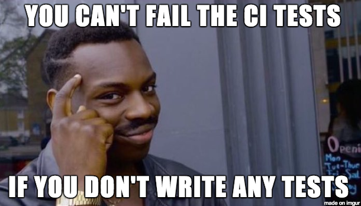

# Step 5 - Task: CI/CD Pipeline Testing

[<Prev](./step4.md) | [Main](../../README.md) | [Next>](./step6.md)

---

[TOC]



## Task

Testing in a CI/CD Pipeline is the holy grail of automated testing. Your tests need to be executed in a CI/CD Pipeline, which then makes a decision based on the results of the tests.

### Technical Acceptance Criteria

-   You have pipeline tasks scripted to execute your tests.
-   Your pipeline will make a decision based on the results of those tests, so your results need to be publishable.
    -   This can simply be whether to print something to the console, or any other task.
-   You will need to submit your pipeline files.
    -   If you are practicing with a paid pipeline solution via your client, etc. we'll need screenshots of your pipeline results as well.

## General Instructions

Using some CI/CD solution or task runner, create a task that executes your tests, gets the results, and follows up with another task if the tests pass.

Potential Tools:

-   CircleCI
-   Jenkins
-   AWS
-   Azure DevOps
-   etc.

The tool you use is not important; but that you have some "pipeline" that when executed checks your tests and acts on the results.

### Example: Azure DevOps Pipline YAML

In the example below, my developers can use my test template in their deployment pipelines. These can automatically run the tests on the new builds when they check in new code, and determine whether or not to promote the build through the "lower lanes" of our dev/test environments.

> **Please note**: This example is FAR more complicated than I require you to submit. You do NOT need to containerize your tests, etc. this is just an example of how what you're learning here can be used in practice.

```yaml
# Example of a pipeline triggering on checkins to the `main` branch, executing tests, and making a choice based on it.
trigger:
    - main

pool:
    name: private linux
    demands: docker

stages:
    - stage: Test
      displayName: Execute Tests
      jobs:
          - template: ./test-job-template.yml
            parameters:
                app: myApp
                # lane: "test"
                # includedTags: "@smoke"
                # excludedTags: "@wip"
                # testRunnerVersion: "latest"
                # publishResults: true
    - stage: Promote Build
      displayName: Promote Successful Build
      dependsOn: Test
      consition: succeded()
      jobs:
          - script: echo Congrats, your tests passed.
```

```yaml
# Example test template that can be incorporated into other pipelines, like the one above.
parameters:
    lane: "test"
    # test, stage, prod (note: prod only works for a select
    # few tests (like canary tests))
    includedTags: "@smoke"
    # comma separated list of tags that should be on a test
    # to run ("@regression,@apiOnly" will run all tests that
    # are marked regression && apiOnly)
    excludedTags: "@wip"
    # comma spearated list of tags NOT to include in a test
    # current tags in use: @smoke @regression @canary
    # @apiOnly @wip
    app: "**"
    # the name of the app to execute tests for -- tests
    # against all configured apps if not provided
    testRunnerVersion: "latest"
    # if you have a specific test runner version you want,
    # put it here, otherwise leave default
    publishResults: true
    # mark false if you don't want test results to publish
    # to Azure

jobs:
    - job:
      displayName: "Running Test Job"
      variables:
          container: foo-${{parameters.lane}}-${{parameters.app}}
      steps:
          - checkout: none

          - task: DockerInstaller@0
            displayName: "Install Docker version 17.09.0-ce"
            inputs:
                dockerVersion: "17.09.0-ce"

          - task: Docker@2
            displayName: "Docker Artifactory base login"
            inputs:
                containerRegistry: "Lorem Ipsum" # External docker service connection
                command: login

          - task: NodeTool@0
            inputs:
                versionSpec: "14.x"

          - task: CmdLine@2
            displayName: "Run cycle(s)"
            inputs:
                script: |
                    docker image pull foo-bar:${{parameters.testRunnerVersion}}
                    docker run --rm -v $(pwd)/results:/app/results foo-bar:${{parameters.testRunnerVersion}} node utilities/runTests.js -l ${{parameters.lane}} -i ${{parameters.includedTags}} -e ${{parameters.excludedTags}} -f ${{parameters.app}} -p

          - ${{ if eq(parameters.publishResults, 'true') }}:
                - task: PublishTestResults@2
                  condition: succeededOrFailed()
                  displayName: "Publish result(s)"
                  inputs:
                      testRunner: JUnit
                      testResultsFiles: "results/combined.xml"
```

## Keep In Mind

> **Keep it Simple**
>
> You don't need anything massive here. A small (and FREE) pipeline where task A runs tests, and task B runs if they passed is more than enough. In fact, if you create something like this for your client, that is probably more than enough for them!
>
> This certification is NOT about DevOps, but about integrating our testing into the process.

## General Links

-   [Parasoft: Implementing QA in a CI CD Pipeline](https://www.parasoft.com/blog/implementing-qa-in-a-ci-cd-pipeline/)
    -   A great overview of how CI/CD pipelines work and how QA can fit.
-   [LambdaTest: 31 Best CI CD Tools](https://www.lambdatest.com/blog/31-best-ci-cd-tools/https://www.lambdatest.com/blog/31-best-ci-cd-tools/)
    -   Potential tools you can work with.
