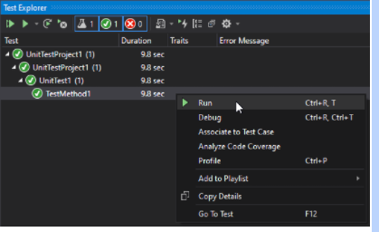

# Step 1: C# Specific

< Prev | [General Step Instructions](../step1.md) | [Next >](./CSharp2.md)

---

[TOC]

## Summary

Setting up Selenium WebDriver tests in C# is not difficult. It may take a fair amount of setup but once you understand all of the moving parts it is one of the better languages to automate in. C# syntax is similar to Java in many ways with some key differences as you will see throughout this certification. Rather than using packages like java to include external code utilities, C# uses what are called "Nuget" packages. These are easy to manage using Visual Studio and we will show you how. 

- **Environment**: `C# (.Net framework)`
- **Test Framework**: `NUnit`

## Environment Setup

1. Installing Visual Studio:
   1. If you don’t already have Visual Studio (community version) installed, download it from [here](https://visualstudio.microsoft.com/downloads/).
2. Setting up your new solution/project
   1. In visual studio, select “Create a new project".
   2. Search “unit test” and select the Unit Test Project(.Net Framework).
   3. Click “Next”, name your project and solution, and select a file location. **This file location needs to be within the `/automation/` folder you set up earlier.**
   4. Click “Create"
3. Add required Nuget Packages to your solution
   1. In your Solution Explorer, right click your solution’s “References” and select “Manage NUget packages...”  
   
      

   2. In the “Browse” tab, search and install the following packages:   
   
      

   3. Make sure your installed version of Google Chrome is at least the version of the ChromeDriver that is installed.   


## Your First Test


   1. Use the “Solution Explorer” on the right hand side of Visual Studio to navigate between your solution files. In your solution you should have a file named “UnitTest1.cs”. Change the code in this file to match the code below:
    ```C#
    using System;
    using NUnit.Framework;

    namespace UnitTestProject1
    {
        [TestFixture]
        public class UnitTest1
        {
            [SetUp]
            public void SetUp()
            {
                Console.WriteLine("This is the setup method");
            }

            [Test]
            public void TestMethod1()
            {
                Console.WriteLine("this is the Test method.");
            }

            [TearDown]
            public void TearDown()
            {
                Console.WriteLine("This is the teardown method.");
            }
        }
    }
    ```

    The above code is the structure you will use for most automated tests. C# uses “using directives” to include code from an external source (lines 1 and 2). You will place a “namespace” after the using keyword. Visual Studio has predictive text to help you find what you are trying to include. The NUnit tags establish your one-time Setup, Test, and one-time Teardown methods and are surrounded by [square brackets] just prior to the method declaration. Automated tests must all be public and their return type is usually void because the test results are reported and stored elsewhere. All of this is contained within the public test class or “Test Fixture”. You can also group related tests in different files together using a namespace which in this case is “UnitTestProject1” and contains our test class.

2.  Now we will run our test. In the “Test” option at the top, select “Test Explorer” to open the test explorer. In the test explorer, tests will be grouped by solution, then by namespace, then by class. Right click the test method name in the test explorer and click “Run”.   

   


After the test runs, left click the test name and select the “Open additional output for this result” in the Test Detail Summary. This will show you your console output.

5. Now let's implement Selenium and Chromedriver to create our first automated UI test. Update our UnitTest1.cs file to contain the following code:

    ```C#
    using System.Threading;
    using NUnit.Framework;
    using OpenQA.Selenium;
    using OpenQA.Selenium.Chrome;

    namespace UnitTestProject1
    {
        [TestFixture]
        public class UnitTest1
        {
            IWebDriver driver;
            
            [SetUp]
            public void SetUp()
            {
                driver = new ChromeDriver();
            }

            [Test]
            public void TestMethod1()
            {
                driver.Navigate().GoToUrl("https://www.google.com");
                Thread.Sleep(5000);
            }

            [TearDown]
            public void TearDown()
            {
                driver.Quit();
            }
        }
    }
    ```

    Using the Test Explorer, right click our test again and run it. You should see a chrome window open, navigate to google, wait 5 seconds, and then close. Congratulations! You just ran your first automated test in C#!   


    ***If you get this error message, end all Chromedriver task in your task manager   

       


## Assertions   

   1. For asserting in C# automation, we us Nunit once more. There are many different assert methods that can be used to either compare values or validate information. Please see the various assertion methods [here](https://docs.nunit.org/articles/nunit/writing-tests/assertions/assertion-models/classic.html).
   2. Change your initial test to match the following:   

    ```C#
    using System.Threading;
    using NUnit.Framework;
    using OpenQA.Selenium;
    using OpenQA.Selenium.Chrome;

    namespace UnitTestProject1
    {
        [TestFixture]
        public class UnitTest1
        {
            IWebDriver driver;
            
            [SetUp]
            public void SetUp()
            {
                driver = new ChromeDriver();
            }

            [Test]
            public void TestMethod1()
            {
                driver.Navigate().GoToUrl("https://www.google.com");
                Thread.Sleep(5000);
                Assert.AreEqual(Driver.Title, "Google");
                Assert.That(Driver.Title.Equals("Google"));
                Assert.That(Driver.Title.Equals("Foo"), "This is a custom error message");
            }

            [TearDown]
            public void TearDown()
            {
                driver.Quit();
            }
        }
    }
    ```   

    3. _Your test should have failed!_ As you can see we have 3 different options for assertions used in this single test. The first does a compare between the first and second arguments that are passed to the "AreEqual" method. The second assertion is simply looking for the first and only argument passed to the "That" method to be true. The third assertion is the same as the second, but it is looking for an incorrect page title (Foo) that does not match what was returned from our "Driver.Title" property, therefore it fails the test. In addition, all Nunit assertions have an optional string argument that you can pass as the last argument to have Nunit display a custom error message, like we did with the third assertion.  

## Debugging

Visual Studio has a great debugger built in. You can pause a test's execution allowing you to view current variable values and step through code in real time. By adding what visual studio calls "Breakpoints" you can tell the debugger where you would like the code to pause. You add a breakpoint by left clicking margin (the grey vertical bar) to the left of the line of code. You can then right click the test in the Test Explorer and select "Debug" instead of "Run" and you're off! You can find all of the instructions on how to use the debugger [here](https://docs.microsoft.com/en-us/visualstudio/debugger/debugger-feature-tour?view=vs-2022).

## Tutorials/Docs

- [Official C# documentation](https://docs.microsoft.com/en-us/dotnet/csharp/tour-of-csharp/)
- [ToolsQA C# Selenium tutorial](https://www.toolsqa.com/selenium-c-sharp/)
- [NUnit documentation](https://docs.nunit.org/articles/nunit/intro.html)
- [Getting started with Visual Studio](https://visualstudio.microsoft.com/vs/getting-started/)
- [Debugging](https://docs.microsoft.com/en-us/visualstudio/debugger/debugger-feature-tour?view=vs-2022)