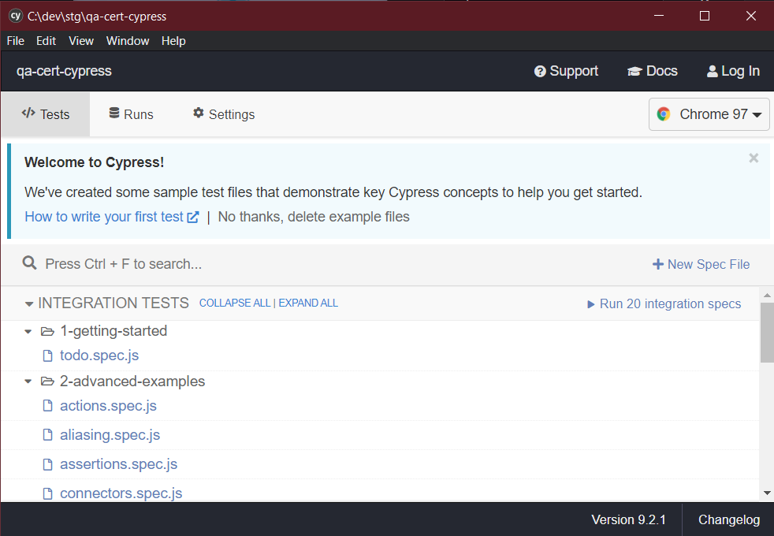
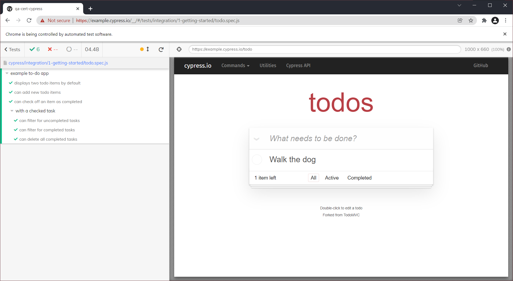
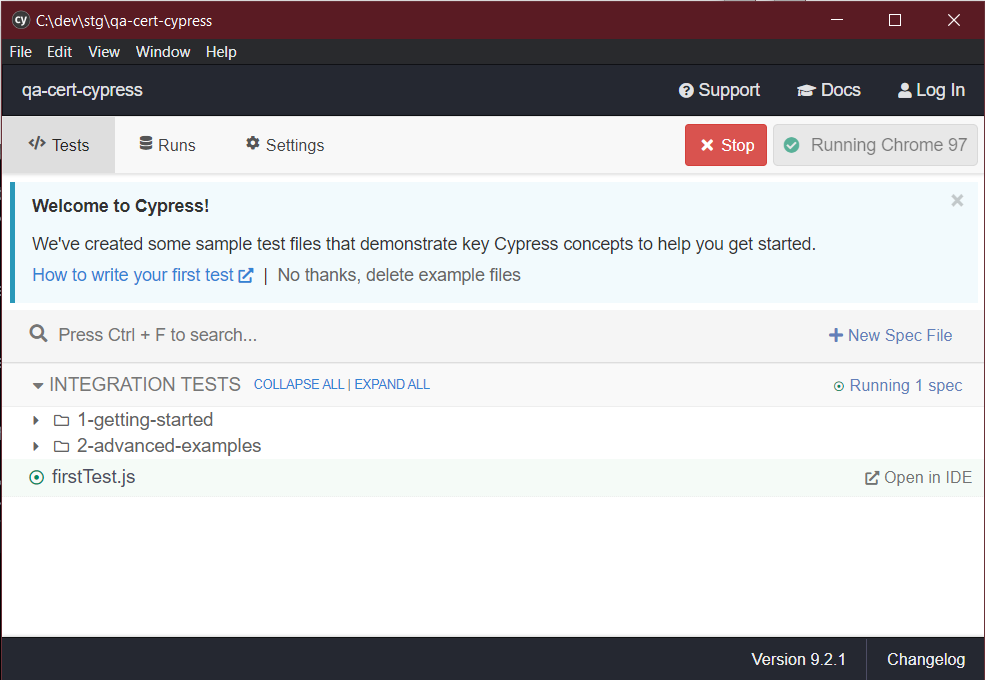
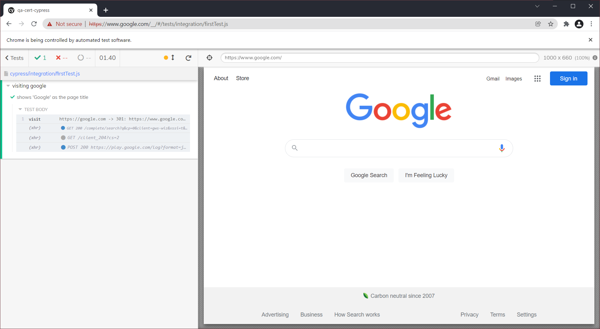
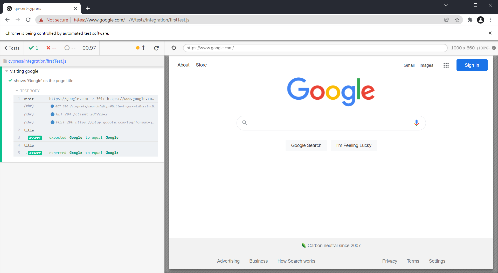

# Step 1: Cypress Specific

< Prev | [General Step Instructions](../step1.md) | [Next >](./cy2.md)

---

[TOC]

## Summary

Cypress setup is quite simple. I'll walk you through setup here, or you can checkout the official docs (linked at the bottom).

## Environment Setup

1. Install NodeJS
    - Download [here](https://nodejs.org/en/download/)
    - Verify install was successful by executing this command in your terminal/command line/bash:
        - `npm -version`
        - You should get back something like `6.14.12`
1. Install Cypress
    - From the project's base directory, run the following command:
        - `npm i --save-dev cypress`
            - This installs Cypress as a project dependency
1. Initialize Cypress
    - From the project's base directory, run the following command:
    - `node_modules/.bin/cypress open`
        - After Cypress initializes, you will see the Cypress Test Runner:
        - 
1. Check initialization
    - Your project directory should now look something like this:
    ```
    |-- cypress
    |-- node_modules
    |-- readme
    |-- src
    | .gitignore
    | cypress.json
    | package-lock.json
    | package.json
    | README.md
    ```
    - The `cypress.json` folder defines the project's configuration for Cypress
        - **Note:** if a project already has a cypress.json folder, Cypress will read that rather than creating a new Cypress folder and configuration file when you run the package.
    - The `cypress` folder is where your automation will live, and where there are already demos!

That is IT! Cypress is now ready to roll.

-   You can click into a run any of the demos shown in the Cypress Test Runner, and see the browser launch for the Test Runner, and get an idea of how tests are executed here.
    -   

> **Note:** This project is already initialized for Node. When starting from scratch, go to your project's base folder and execute the following command to set up with default node configuration (a `package.json` and the ability to install dependencies).
>
> -   `npm init -y`
>
> There is also already a `.gitignore` file to ignore the `/node_modules/` folder with all of your dependencies. In a brand new project, this probably would not exist.

## Your First Test

-   Now it's time to make sure your setup went correctly.
-   I recommend using [VS Code](https://code.visualstudio.com/download) for your JS automation, but you can use your IDE of choice.
    -   Cypress tests are written either in JS or TS, so VS Code is great for these.

1.  Add a test file to your automation directory. I called mine `firstTest.js`.
    -   Cypress tests, by default, live in the `cypress/integration` folder, so you'll create this test there.
        -   Rather than needing a `firstTest.test.js` notation, or anything like that, Cypress knows just to run tests in the `integration` folder.
    -   I'm also adding a "triple slash directive" to the start of the file so that VS Code knows how to interpret my code/give me type-ahead tooltips, etc.
    ```js
    /// <reference types="Cypress" />
    ```
2.  We use `describe` blocks to organize our tests. They can be nested. As I'm going to hit Google first, we'll describe that.
    ```js
    /// <reference types="Cypress" />
    describe("visiting google", () => {
        // your test will go here
    });
    ```
3.  We use `it` blocks for the individual tests. This way the output will order:
    ```
    1. Thing you described
        1. It does x
        1. It does y
        1. It does z
    1. The other thing you described...etc.
    ```
    So in our test, we'll add that `it` block.
    ```js
    /// <reference types="Cypress" />
    describe("visiting google", () => {
        it("shows 'Google' as the page title", () => {
            // the meat of the test goes here
        });
    });
    ```
    -   This structure will allow your test results to show something like:
    ```
        * visiting google
            * shows 'Google' as the page title
    ```
4.  Now, to interact with the browser, we just need to use the global `cy` object to get our webpage.
    -   This object handles the browser, queuing instructions, waiting for asynchronous actions, etc.
    -   Some limits, but generally easier than using Selenium Webdriver.
    ```js
    /// <reference types="Cypress" />
    describe("visiting google", () => {
        it("shows 'Google' as the page title", () => {
            cy.visit("https://google.com");
        });
    });
    ```
    -   The `visit` command tells our browser to navigate to the given URL.
        -   Cypress 'commands' are methods on the `cy` object, and are frequently chainable.
    -   We don't need to `quit` the browser like you would with Selenium. Cypress leaves your page up and open intentionally, automatically re-running for changes.
5.  In the window with the tests listed out, go ahead and select `firstTest.js` to see how this works...
    

    -   Your browser window should open (or re-open if you had a previous demo test running) and look something like this after the test executes:
        
    -   Don't worry that the browser doesn't close after a test runs. This is intentional, check out the links at the end of this step for more info.

6.  Now that we've navigated, we need to assert!

    -   There are two real ways to do assertions in Cypress.
        -   `expect` statements
        -   chained `should` statements
    -   To each their own, this example will show you both, using Cypress's chained commands.

    *   **firstTest.js**

        ```js
        /// <reference types="Cypress" />
        describe("visiting google", () => {
            it("shows 'Google' as the page title", () => {
                cy.visit("https://google.com");
                // cy.title() returns the title of the page asynchronously.

                // chaining .should() from the .title() command passes the page
                // title into the "should" method, allowing us to assert on it.
                cy.title().should("equal", "Google");

                // otherwise, we can use "then" to asynchronously execute a callback
                // after the title method is complete, and assert on what gets passed
                // in.
                cy.title().then((text) => {
                    expect(text).to.equal("Google");
                });
            });
        });
        ```

    -   The Cypress Test Runner automatically re-executes the open test when changes are made - when complete your test should look something like this -
        
        -   Note that you can see two assertions, since we asserted the same thing twice.

That's it -- Cypress is set up and you're good to get going on writing your tests!

There is a LOT to do and to learn in Cypress, especially about debugging - so taking a look at the demo tests and some of the Cypress official docs/instructions is quite useful.

## Gotchas

If an app throws an uncaught exception, Cypress will auto-fail the test. (This application DOES throw these)

An uncaught exception doesn't automatically mean an app is broken, however.

### The Solution

We'll tell Cypress NOT to autofail on an uncaught exception in our app. If it causes problems down the line, we'll get unexpected behaviors in the app, which should end up failing an assertion anyway.

Add this code to your `cypress/support/index.js` to ignore the exceptions. (It will log them to the console, but then continue your test)

`index.js` update

```js
Cypress.on("uncaught:exception", (err, runnable) => {
    console.log(err, runnable);
    return false;
});
```

## Tutorials/Docs

-   **[cypress.io](https://cypress.io)**
    -   [Why Cypress?](https://docs.cypress.io/guides/overview/why-cypress)
    -   [Writing Your First Test](https://docs.cypress.io/guides/getting-started/writing-your-first-test)
    -   [API docs (commands)](https://docs.cypress.io/api/table-of-contents)
    -   [Assertions](https://docs.cypress.io/guides/references/assertions)
    -   [The Test Runner](https://docs.cypress.io/guides/core-concepts/test-runner)
