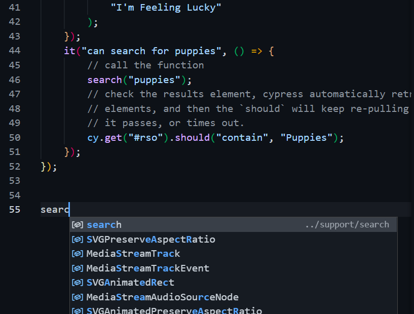

# Step 4: Cypress Specific

[< Prev](./cy3.md) | [General Step Instructions](../step4.md) | [Next >](./cy5.md)

---

[TOC]

## Summary

Exporting and importing code is pretty straightforward in Cypress. Unless you have set up a more complicated environment, you'll be using `exports` and `require` to make your function available and use it in different files.

-   This leverages the NodeJS "Module" system.

This example, illustrating how we can move the function made in the last example into a new file, gives you the same basic steps you'll use to move the login function, and use it in both your user and admin test files.

### Simple Example

In this example, I didn't have to edit the tests in my test file at all. I just moved the search function to a separate file.

#### `search.js`

Cypress wants ONLY test files in your `cypress/integration` directory. We'll be adding our new file into the `cypress/support` directory. \* This is where we'll have custom commands, etc., not just helper functions.

1. First, just cut and paste the function into your new file.
1. Export the function. This was as simple as adding a line below the function:
    - `exports.search = search`
    - This makes the identifier `search` available for my other files to use, and then assigns the `search` function to it.

```js
function search(term) {
    // .type(text:string) will type the text passed in INTO the
    // element yielded by the previous command.
    cy.get("[name=q]").type(term);
    // .click() will click the element yielded by the previous command!
    // go figure.
    cy.get("[name=btnK]").eq(0).click();
}
// this exports our search function as "search", and makes it available
// to other files.
exports.search = search;
```

-   Notice that I didn't include the triple slash directive `/// <reference types="Cypress" />`
    -   It isn't required for the code to work.
    -   However, if I try to make changes to the function, the Cypress hints won't work.

#### firstTest.js

Requiring our search function isn't too hard to do. We just require the `search` property from `search.js`, and assign it to a constant in our test file.

-   `const { search } = require("../support/search");`
    or
-   `const search = require("../support/search").search;` the difference between this and the last has to do with object destructuring, if you want to google that!
    or
-   `const search = require("../support/search");` if we change our export in `search.js` to `module.exports = search`

Still, I think the easiest way to import anything is to use the autocomplete in VS Code. Since we already set up the `export.search` in `search.js`, this is what shows up when I start typing `search` in `firstTest.js`...



From here I make sure the right suggestion is highlighted (as it is in in the screencap), and hit `Tab` on my keyboard. The appropriate code is auto-inserted into my requires up top!

```js
/// <reference types="Cypress" />

const { search } = require("../support/search");

describe("visiting google", () => {
    beforeEach(() => {
        cy.visit("https://google.com");
    });
    it("shows 'Google' as the page title", () => {
        // I'm simplifying here, since the chained assertion is easiest
        // for most situations.
        cy.title().should("equal", "Google");
    });
    it("has a valid UI", () => {
        cy.visit("https://google.com");
        cy.get("input[name=q]")
            .should("be.visible")
            // should assertions yield the subject of their assertion
            // to the next method, so we can keep chaining.
            .should("have.attr", "title", "Search")
            .should("have.value", "");
        // There are TWO input buttons with the name "btnK"
        // cy.get("[name=btnK]") will yield both
        // the `.eq(0)` method picks the first from the results
        // just like in jQuery.
        // The first is hidden on the autocomplete popup, but
        // the second, at index 1, is visible right away.
        cy.get("[name=btnK]").eq(1).should("be.visible");
        // We could also chain a .find() off of a .get() to sort of
        // "search within" a previous element or elements. Here I
        // will get the autocomplete popout, and find the Google Search
        // button within it.
        cy.get("[jsaction*=mouseout]")
            .find("[name=btnK]")
            .should("not.be.visible")
            .should("have.value", "Google Search")
            .should("have.attr", "type", "submit");
        // cy.contains(someText) will search the whole page, or chain
        // off of a previous .get() or .find()
        cy.contains("I'm Feeling Lucky").should(
            "have.attr",
            "aria-label",
            "I'm Feeling Lucky"
        );
    });
    it("can search for puppies", () => {
        // call the function
        search("puppies");
        // check the results element, cypress automatically retries locating
        // elements, and then the `should` will keep re-pulling `#rso` until
        // it passes, or times out.
        cy.get("#rso").should("contain", "Puppies");
    });
});
```

#### Some things to notice:

-   Since my test was using the function named `search` and I imported the function to the constant `search`, I didn't need to tweak the tests themselves to still be able to use it -- I only needed to make sure to import it correctly.
-   You can export more than one thing from a file. Want to make a `functions.js` file and export another function to handle navigating through the menu? Go for it! Your export might look something like:

```js
exports.search = search;
exports.chooseMenuOption = chooseMenuOption;
```

-   Also, there are very few key words in JavaScript/Cypress. Name your variables, functions, properties, etc. in a way that makes sense to you.

```js
// this would work, but it could get confusing.
const steve = (term) => {
    /* search function here */
};
exports.search = steve;
```

-   You'll see different coding examples using `export` and `import` statements sometimes when looking across the internet. These are "ES6" formatted statements, and can work with a little extra setup work to "transpile" your code. We're using `exports` and `require`, since these are "CommonJS" formatted statements and require no additional setup to work in our Node.js environment.

## Tutorials/Docs

-   [Node.js Modules (Node.js official)](https://nodejs.org/api/modules.html)
-   [Understanding module.exports and exports in Node.js (Sitepoint)](https://www.sitepoint.com/understanding-module-exports-exports-node-js/)
-   Official Docs:
    -   [Cypress Folder Structure](https://docs.cypress.io/guides/core-concepts/writing-and-organizing-tests#Folder-structure)
