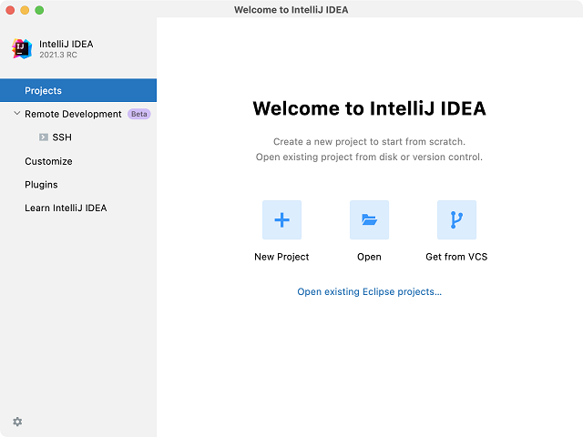
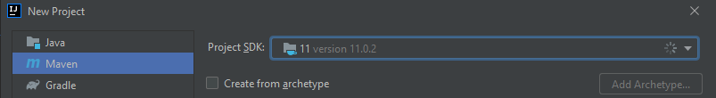
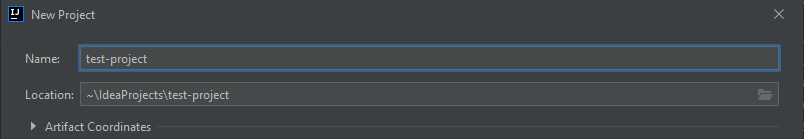
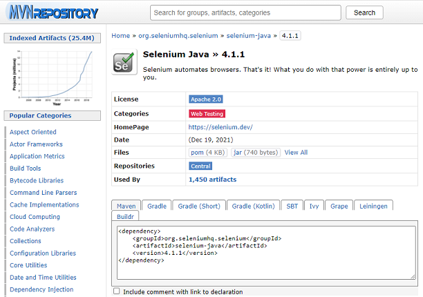
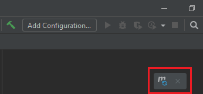
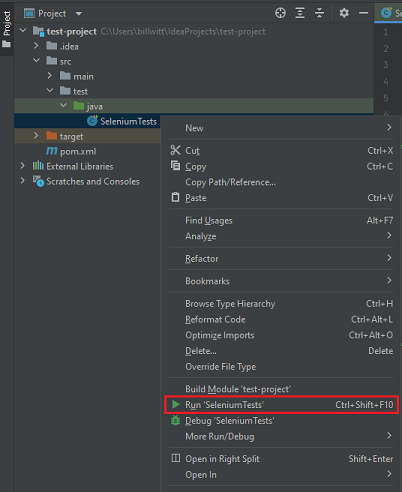
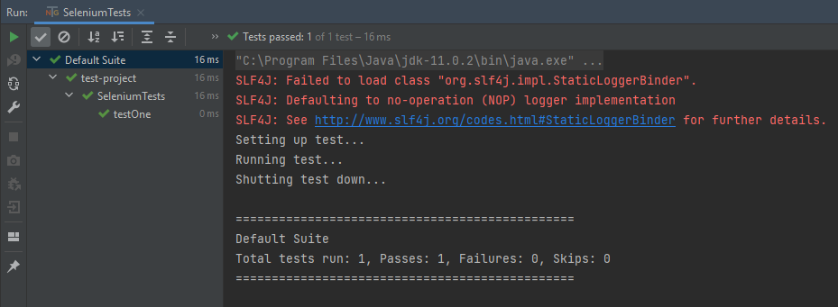
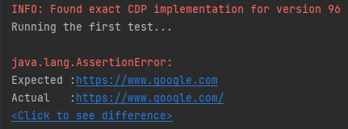

# Step 1: Java Specific

[General Step Instructions](../step1.md) | [Next >](./java2.md)

---

[TOC]

## Summary

Java is among the top three languages used for test automation, and tends to be in high demand in the market. In this section we'll be setting up a new test automation project in the IntelliJ IDE. In this project we'll be using Java 11 and the TestNG testing framework to create our Selenium WebDriver tests.  

- **Environment**: `Java 11+`
- **IDE**: `IntelliJ IDEA Community Edition`
- **Test Framework**: `TestNG`

## Environment Setup

1. Installing IntelliJ IDEA by JetBrains:
    1. Navigate to the IntelliJ download page and download a copy of the Community Edition [here](https://www.jetbrains.com/idea/download/).
    2. Run the IntelliJ installation file and follow installation prompts.
2. Setting up a new project:
    1. Create a new project in IntelliJ
       1. If this is the first time using IntelliJ, select "New Project" from the IntelliJ Welcome page  
          
       2. If creating a new project from within IntelliJ, select the following from the top menu:
          `File -> New -> Project...`  
    2. Select the Maven option for the project type, and the Java SDK version to be used.  
         
    3. Click the "Next" button, then enter the desired project name in the "Name" text box. The location of the project can be set here as well.
         
    4. Click the "Finish" button.  
3. Add dependencies to the project with the Maven POM (Project Object Model) file:
    1. In the root directory of your project, open the `pom.xml` file.  
       1. The automatically generated POM should look similar to this:
       ```XML 
            <?xml version="1.0" encoding="UTF-8"?>
            <project xmlns="http://maven.apache.org/POM/4.0.0"
                 xmlns:xsi="http://www.w3.org/2001/XMLSchema-instance"
                 xsi:schemaLocation="http://maven.apache.org/POM/4.0.0 
                 http://maven.apache.org/xsd/maven-4.0.0.xsd">
            <modelVersion>4.0.0</modelVersion>
       
            <groupId>org.example</groupId>
            <artifactId>test-project</artifactId>
            <version>1.0-SNAPSHOT</version>
       
            <properties>
                 <maven.compiler.source>11</maven.compiler.source>
                 <maven.compiler.target>11</maven.compiler.target>
            </properties>
       
            </project>
       ```
       
    2. Navigate to the Maven Repository [here](https://mvnrepository.com/). This is where all necessary dependencies can be found for the project (Selenium, TestNG, etc.).    
       1. Search for the desired dependency using the site's search feature, select the library found, select the version needed, then copy the dependency XML.  
              
       2. Create the `<dependencies></dependencies>` tag in the `pom.xml` file, then copy the dependencies inside the tag. For this project we'll be including dependencies for Selenium, TestNG, and WebDriver.  
       3. Next, create the `<build></build` tag, and within that tag add the `<plugins></plugins>` tag.  
       4. The following dependencies will be installed:
          1. Selenium for Java
          2. TestNG Test Framework
          3. WebDriver Manager
       5. The following plugins will be installed
          1. Maven Compiler
          2. Maven Surefire
       6. The updated POM file should now look like this (versions may be outdated):
       ```XML 
            <?xml version="1.0" encoding="UTF-8"?>
            <project xmlns="http://maven.apache.org/POM/4.0.0"
                 xmlns:xsi="http://www.w3.org/2001/XMLSchema-instance"
                 xsi:schemaLocation="http://maven.apache.org/POM/4.0.0 http://maven.apache.org/xsd/maven-4.0.0.xsd">
            <modelVersion>4.0.0</modelVersion>
       
            <groupId>org.example</groupId>
            <artifactId>test-project</artifactId>
            <version>1.0-SNAPSHOT</version>
       
            <properties>
                 <maven.compiler.source>11</maven.compiler.source>
                 <maven.compiler.target>11</maven.compiler.target>
            </properties>
       
            <dependencies>
                 <dependency>
                      <groupId>org.seleniumhq.selenium</groupId>
                      <artifactId>selenium-java</artifactId>
                      <version>4.0.0</version>
                 </dependency>
                 <dependency>
                      <groupId>org.testng</groupId>
                      <artifactId>testng</artifactId>
                      <version>7.4.0</version>
                 </dependency>
                 <dependency>
                      <groupId>io.github.bonigarcia</groupId>
                      <artifactId>webdrivermanager</artifactId>
                      <version>5.0.3</version>
                 </dependency>
            </dependencies>
       
            <build>
                 <plugins>
                      <plugin>
                           <groupId>org.apache.maven.plugins</groupId>
                           <artifactId>maven-compiler-plugin</artifactId>
                           <version>3.8.1</version>
                           <configuration>
                                <source>11</source>
                                <target>11</target>
                           </configuration>
                      </plugin>
                      <plugin>
                           <groupId>org.apache.maven.plugins</groupId>
                           <artifactId>maven-surefire-plugin</artifactId>
                           <version>2.22.2</version>
                      </plugin>
                 </plugins>
            </build>
       
       </project>
       ```
       
    3. Manually import all the added dependencies and plugins by either using the shortcut `Ctrl+Shift+O`, or by clicking the maven import button (shown in the upper right of the window).
         
4. Your installed version of Google Chrome should be supported by the latest version of WebDriver Manager.


## Your First Test


1. In the file tree on the leftmost pane of IntelliJ, expand the tree to display `src/test/java`. Right-click the `java` folder and select the `New -> Java Class` option, and then name the Class (e.g., "SeleniumTests"). This will create a new Java class file for our test automation code. Add the following test structure code to the new class file:    
    ```Java 
         import org.testng.annotations.AfterClass;
         import org.testng.annotations.BeforeClass;
         import org.testng.annotations.Test;
    
         public class SeleniumTests {
    
              @BeforeClass
              public void init() {
                 System.out.println("Setting up test...");
              }
         
              @Test
              public void testOne() {
                 System.out.println("Running test...");
              }
   
              @AfterClass
              public void tearDown() {
                 System.out.println("Shutting test down...");
              }
           }
    ```
  
    This code is a simplified example of a typical Selenium WebDriver test structure. Note the annotations used, `@BeforeClass`, `@AfterClass`, and `@Test`. These annotations come from the TestNG framework, and are used to control what happens before, after and when a test is run.  

2. Let's go ahead and run the code, primarily to verify that WebDriver is set up and working properly. There are several ways to run a test with the TestNG framework, but we'll just focus on running the test via the project tree for now.  
   1. Within the project tree in the leftmost pane, select and right-click the new test class file, then select the "Run..." option with the green arrow.  
          
   2. If the test runs successfully, the console output in the bottom pane should be similar to this:  
          
3. Now let's implement Selenium and Chromedriver to create our first automated UI test. Update our test file to contain the following code:  
    ```Java 
         import io.github.bonigarcia.wdm.WebDriverManager;
         import org.openqa.selenium.WebDriver;
         import org.openqa.selenium.chrome.ChromeDriver;
         import org.testng.annotations.AfterClass;
         import org.testng.annotations.BeforeClass;
         import org.testng.annotations.Test;
          
         import java.util.concurrent.TimeUnit;
          
         public class SeleniumTests {
          
             WebDriver driver;
          
             @BeforeClass
             public void init() {
                 System.out.println("Setting up test...");
                 WebDriverManager.chromedriver().setup();
                 driver = new ChromeDriver();
             }
              
             @Test
             public void testOne() throws InterruptedException {
                 System.out.println("Running test...");
                 driver.navigate().to("https://google.com");
                 TimeUnit.SECONDS.sleep(3); // Sleep used only for the purpose of demonstration
             }
             
             @AfterClass
             public void tearDown() {
                 System.out.println("Shutting test down...");
                 driver.quit();
             }
         }
    ```
* _Note the inclusion of `WebDriverManager.chromedriver().setup()` in our init/setup block. This is from the `WebDriverManager` dependency that we imported in our POM file. It eliminates the need to download and reference the ChromeDriver executable file used to control Chrome with WebDriver, all that is done automatically._
4. In the project panel, right-click our test again and run it. You should see a Chrome window open, navigate to google, wait 3 seconds, and then close down. Congratulations, you just ran your first automated test in Java!


## Assertions

1. In order to assert expected conditions in Java test automation we'll use TestNG again. There are several assert methods that can be used to either compare values or validate information. See the various TestNG assertion methods [here](https://www.javadoc.io/doc/org.testng/testng/6.8.17/org/testng/Assert.html).    
   1. Update your test to the following code with the new assertions added, note that one of these assertions are _expected to fail_:  
     ```Java  
          import io.github.bonigarcia.wdm.WebDriverManager;
          import org.openqa.selenium.WebDriver;
          import org.openqa.selenium.chrome.ChromeDriver;
          import org.testng.Assert;
          import org.testng.annotations.AfterClass;
          import org.testng.annotations.BeforeClass;
          import org.testng.annotations.Test;
          
          import java.util.concurrent.TimeUnit;
          
          public class SeleniumTests {
                 
               WebDriver driver;
               
               @BeforeClass
               public void init() {
                    System.out.println("Setting up test...");
                    WebDriverManager.chromedriver().setup();
                    driver = new ChromeDriver();
               }
               
               @Test
               public void testOne() throws InterruptedException {
                    System.out.println("Running test...");
                    driver.navigate().to("https://google.com");
                    TimeUnit.SECONDS.sleep(3); // Sleep used only for the purpose of demonstration
                    
                    Assert.assertEquals(driver.getTitle(), "Google");
                    Assert.assertEquals(driver.getCurrentUrl(), "https://www.google.com");
               }
               
               @AfterClass
               public void tearDown() {
                    System.out.println("Shutting test down...");
                    driver.quit();
               }
          }
     ```
   
2. _This test should have failed!_ The first assertion correctly verifies that the page tile of the URL navigated to is _equal to_ "Google". As for the other assertion, its failure is shown in the console with a comparison between the expected value to the actual value.
3. Note that the assertion error in the second assertion was thrown because the actual URL has a `/` at the end of the URL, making it equal to "https://www.google.com/".
  
4. Add the forward slash to the end of the URL, run the test again, and the test will pass successfully.

## Debugging

IntelliJ has an excellent debugger built into the IDE. This debugger will allow you to do several things, including the following actions:  
- Pause a test's execution, allowing you to view current variable values and step through the code in real time as it runs.  
- Breakpoints can be set before running a test to tell the debugger where you want the code to pause. These can be added by clicking within the margin to the left of the line of code.   
- To run the debugger and select "Debug" instead of "Run". This will run your test in debug mode.  
- More information on IntelliJ's debugger can be found [here](https://www.jetbrains.com/help/idea/debugging-code.html).  

## Documentation

- [IntelliJ IDEA Documentation](hhttps://www.jetbrains.com/help/idea/discover-intellij-idea.html)
- [Selenium WebDriver Documentation](https://www.selenium.dev/documentation/overview/)
- [TestNG Test Framework Documentation](https://testng.org/doc/documentation-main.html)
- [WebDriver Manager Documentation](https://bonigarcia.dev/webdrivermanager/)
- [Maven Surefire Plugin Documentation](https://maven.apache.org/surefire/maven-surefire-plugin/)
- [Debugging in IntelliJ](https://www.jetbrains.com/help/idea/debugging-code.html)
