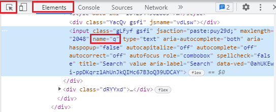

# Step 2: Java Specific

[< Prev](./java1.md) | [General Step Instructions](../step2.md) | [Next >](./java3.md)

---

[TOC]

## Summary

You've been tasked to verify the home page of our new application. You've been given your story -- and it shouldn't be
too hard to verify.

1. You need to navigate to the page.
    - When you are running the application locally, you can load the home page
      with `driver.get("http://localhost:8080")`
2. You need to locate and assert on the proper criteria.
    - You'll need to use `By` locators, such as CSS or XPath selectors, IDs, element names, etc.
    - An excellent reference for using XPath locators can be found on the Mozilla Developer
      site [here](https://developer.mozilla.org/en-US/docs/Web/XPath/Axes).
3. You will also need to know how to handle a wait using Selenium's `WebDriverWait`.

## Simple Example

In the code below WebDriverWait has been added and implemented, the `By` locator has been added for the Google search
bar, as well as a new assertion that checks the `By` locator's attribute type.

```java
import io.github.bonigarcia.wdm.WebDriverManager;
import org.openqa.selenium.By;
import org.openqa.selenium.WebDriver;
import org.openqa.selenium.chrome.ChromeDriver;
import org.openqa.selenium.support.ui.ExpectedConditions;
import org.openqa.selenium.support.ui.WebDriverWait;
import org.testng.Assert;
import org.testng.annotations.AfterClass;
import org.testng.annotations.BeforeClass;
import org.testng.annotations.Test;

import java.time.Duration;

public class SeleniumTests {

    WebDriver driver;
    WebDriverWait wait;

    @BeforeClass
    public void init() {
        WebDriverManager.chromedriver().setup();
        driver = new ChromeDriver();
        wait = new WebDriverWait(driver, Duration.ofSeconds(10));
    }

    @Test
    public void testOne() {
        driver.navigate().to("https://www.google.com/");

        By searchBar = By.name("q");
        wait.until(ExpectedConditions.elementToBeClickable(searchBar));

        Assert.assertEquals(driver.findElement(searchBar).getAttribute("type"), "text", "The searchBar type did not match the expected type 'text'.");
    }

    @AfterClass
    public void tearDown() {
        driver.quit();
    }
}
```

Sometimes it can be a little tricky to find the appropriate locator to use. Our locator is checking the page DOM for an
element with the name `q`. This was found by doing the following on the Google homepage:

- Press the `F12` key to open up the Developer Tools pane, or by using the shortcut `Ctrl+Shift+I`
- Select the `Elements` tab at the top of the pane
- Click the Element Inspector icon at the top (box with an arrow), or use the shortcut `Ctrl-Shift-C`
- Select the search bar and click it
- Note the highlighted `input` block in the Dev Tools window, one of the listed attributes is `name`, with the value "**
  q**"
  
  

## Documentation

* Official Docs
    - [By](https://www.selenium.dev/selenium/docs/api/java/org/openqa/selenium/By.html)
    - [WebElement](https://www.selenium.dev/selenium/docs/api/java/org/openqa/selenium/WebElement.html)
    - [WebDriverWait](https://www.selenium.dev/selenium/docs/api/java/org/openqa/selenium/support/ui/WebDriverWait.html)
* Selenium WebDriver
    - [Locating elements](https://www.selenium.dev/documentation/en/webdriver/locating_elements/)
    - [Web element](https://www.selenium.dev/documentation/en/webdriver/web_element/)
    - [Waits](https://www.selenium.dev/documentation/en/webdriver/waits/)
