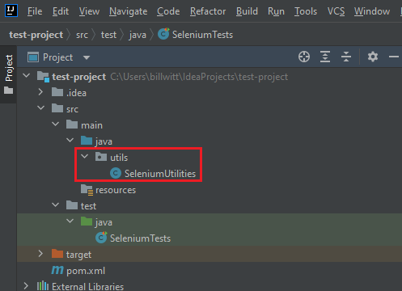

# Step 4: Java Specific

[< Prev](./java3.md) | [General Step Instructions](../step4.md) | [Next >](./java5.md)

---

[TOC]

## Summary

As briefly mentioned in the previous lab, utility methods are not kept within test classes. In this section we'll be
moving our `searchGoogle` method to a separate utility class, where it can be accessed as a `static` method from our
test class.

### Simple Example

In our new utility class we'll create a new package under `src/main/java` named `utils`. Within this package we'll
create a new utility class named `SeleniumUtilities`. Then we'll just copy our method code to this new class.
  


#### SeleniumUtilities.java

```java
package utils;

import org.openqa.selenium.By;
import org.openqa.selenium.WebDriver;
import org.openqa.selenium.support.ui.ExpectedConditions;
import org.openqa.selenium.support.ui.WebDriverWait;

public class SeleniumUtilities {

    public static void searchGoogle(WebDriver driver, WebDriverWait wait, String searchTerm) {
        By searchBar = By.name("q");
        By searchBtn = By.name("btnK");

        driver.findElement(searchBar).sendKeys(searchTerm);
        wait.until(ExpectedConditions.elementToBeClickable(searchBtn));
        driver.findElement(searchBtn).click();
    }

}
```

* Note that rather than just using `public void` we've added the keyword `static` this time. When we declare a method
  as `static`, we are essentially telling Java that this method does not depend on an instance of the class. This method
  can be accessed directly from other classes without creating a new instance of the `SeleniumUtilities` class, as you
  will see in our updated test code.

#### SeleniumTests.java

```java
import io.github.bonigarcia.wdm.WebDriverManager;
import org.openqa.selenium.By;
import org.openqa.selenium.WebDriver;
import org.openqa.selenium.chrome.ChromeDriver;
import org.openqa.selenium.support.ui.ExpectedConditions;
import org.openqa.selenium.support.ui.WebDriverWait;
import org.testng.Assert;
import org.testng.annotations.AfterClass;
import org.testng.annotations.BeforeClass;
import org.testng.annotations.Test;
import utils.SeleniumUtilities;

import java.time.Duration;

public class SeleniumTests {

    WebDriver driver;
    WebDriverWait wait;

    @BeforeClass
    public void init() {
        WebDriverManager.chromedriver().setup();
        driver = new ChromeDriver();
        wait = new WebDriverWait(driver, Duration.ofSeconds(10));
    }

    @Test
    public void testOne() {
        driver.navigate().to("https://www.google.com");

        String searchTerm = "testing";
        SeleniumUtilities.searchGoogle(driver, wait, searchTerm);

        By results = By.id("search");
        wait.until(ExpectedConditions.visibilityOfAllElementsLocatedBy(results));

        Assert.assertTrue(driver.findElement(results).getText().contains(searchTerm),
                String.format("The search results should contain the term '%s'.", searchTerm));
    }

    @AfterClass
    public void tearDown() {
        driver.quit();
    }

}
```

* In our updated test class we have replaced the local class method `searchGoogle` we were previously using within the
  test class, with a call to `SeleniumUtilities.searchGoogle(driver, wait, searchTerm);` We need to pass the `driver`
  and `wait` instances to the method because the utility class has no access to either of these within its own class.

## Documentation

- [Static vs. Non-Static](https://www.baeldung.com/java-static)
