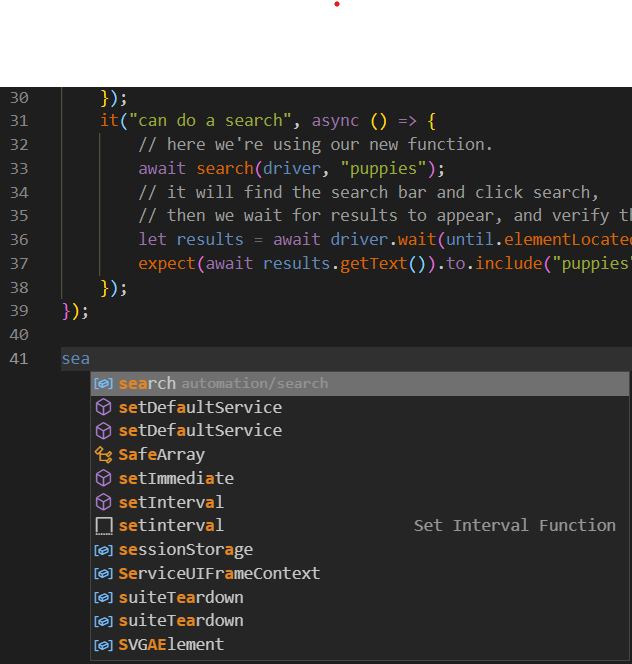

# Step 4: JavaScript Specific

[< Prev](./js3.md) | [General Step Instructions](../step4.md) | [Next >](./js5.md)

---

[TOC]

## Summary

Exporting and importing code is pretty straightforward in JavaScript. Unless you have set up a more complicated environment, you'll be using `exports` and `require` to make your function available and use it in different files.
* This leverages the NodeJS "Module" system.

This example, illustrating how we can move the function made in the last example into a new file, gives you the same basic steps you'll use to move the login function, and use it in both your user and admin test files.

### Simple Example

In this example, I didn't have to edit the tests in my test file at all. I just moved the search function to a separate file.

#### `search.js`

You can create your file in the same directory -- since we're naming our tests `*.test.js` we can filter by name when running the tests so that Mocha doesn't try to run our functions as tests, or you can create a separate folder.

1. First, just cut and paste the function.
1. Check the function to see if you'll need to import anything in this separate file.
    * Since we are passing the function our driver, I don't need to require `Builder` in this file.
    * I will need to require `until` and `By`, since both are used by the search function, but not passed in.
1. Export the function. This was as simple as adding a line below the function:
    * `exports.search = search`
    * This makes the identifier `search` available for my other files to use, and then assigns the `search` function to it.

```javascript
// we need these, since they aren't passed into the function.
const { By, until } = require("selenium-webdriver");

// search = async function(driver, searchTerm){
const search = async (driver, searchTerm) => {
    let search = await driver.wait(until.elementLocated(By.name("q")));
    await search.sendKeys(searchTerm);

    // The button you see on login is hidden when you start typing, and
    // a new search button then appears. We need to find that one.
    // first, locate the element...
    let popoutSearchButton = await driver.wait(
        until.elementLocated(By.name("btnK"))
    );
    // now, wait for it to show up, then click.
    // (note: until.elementIsVisible needs an element, not a By)
    await driver.wait(until.elementIsVisible(popoutSearchButton)).click();
};
// this exports our search function as "search", and makes it available
// to other files.
exports.search = search;
```

#### firstTest.test.js

Requiring our search function isn't too hard to do. We just require the `search` property from `search.js`, and assign it to a constant in our test file.

* `const { search } = require("./search");`
    or
* `const search = require("./search").search;` the difference between this and the last has to do with object destructuring, if you want to google that!
    or
* `const search = require("./search");` if we change our export in `search.js` to `module.exports = search`

Still, I think the easiest way to import anything is to use the autocomplete in VS Code. Since we already set up the `export.search` in `search.js`, this is what shows up when I start typing `search` in `firstTest.test.js`...



From here I make sure the right suggestion is highlighted (as it is in in the screencap), and hit `Tab` on my keyboard. The appropriate code is auto-inserted into my requires up top!

```javascript
const { expect } = require("chai");
// note the added 'until', and 'By'
const { Builder, until, By } = require("selenium-webdriver");
// here is our auto-required search -- but you can type this out manually too.
const { search } = require("./search");

require("chromedriver");

describe("visiting google", () => {
    // we keep the driver in the scope of our base describe, or even outside of it,
    // so once it's defined in the before, it's available everywhere.
    var driver;
    before(async () => {
        driver = await new Builder().forBrowser("chrome").build();
        await driver.get("https://www.google.com");
    });
    after(async () => {
        await driver.quit();
    });
    it("shows 'Google' as the page title", async () => {
        expect(await driver.getTitle()).to.equal("Google");
    });
    it("waits for the search bar to show up", async () => {
        // if you're waiting on an element to be located/visible, etc,
        // that element is returned by the wait
        let search = driver.wait(until.elementLocated(By.name("q")));
        // knowing what you can do with an element when you've found it can be very
        // useful -- though I rarely *actually* get the tag from it.
        expect(await search.getTagName()).to.equal(
            "input",
            "The search bar should be an 'input'"
        );
    });
    it("can do a search", async () => {
        // here we're using our new function.
        await search(driver, "puppies");
        // it will find the search bar and click search,
        // then we wait for results to appear, and verify them
        let results = await driver.wait(until.elementLocated(By.id("search")));
        expect(await results.getText()).to.include("puppies");
    });
});
```


#### Some things to notice:

* Since my test was using the function named `search` and I imported the function to the constant `search`, I didn't need to tweak the tests themselves to still be able to use it -- I only needed to make sure to import it correctly.
* You can export more than one thing from a file. Want to make a `functions.js` file and export another function to handle navigating through the menu? Go for it! Your export might look something like:

```javascript
exports.search = search
exports.chooseMenuOption = chooseMenuOption
```

* Also, there are very few key words in JavaScript. Name your variables, functions, properties, etc. in a way that makes sense to you.


```javascript
// this would work, but it could get confusing.
const steve = (driver, searchTerm)=>{
    /* search function here */ 
}
exports.search = steve
```

* You'll see different coding examples using `export` and `import` statements sometimes when looking across the internet. These are "ES6" formatted statements, and can work with a little extra setup work to "transpile" your code. We're using `exports` and `require`, since these are "CommonJS" formatted statements and require no additional setup to work in our Node.js environment.

## Tutorials/Docs

- [Node.js Modules (Node.js official)](https://nodejs.org/api/modules.html)
- [Understanding module.exports and exports in Node.js (Sitepoint)](https://www.sitepoint.com/understanding-module-exports-exports-node-js/)