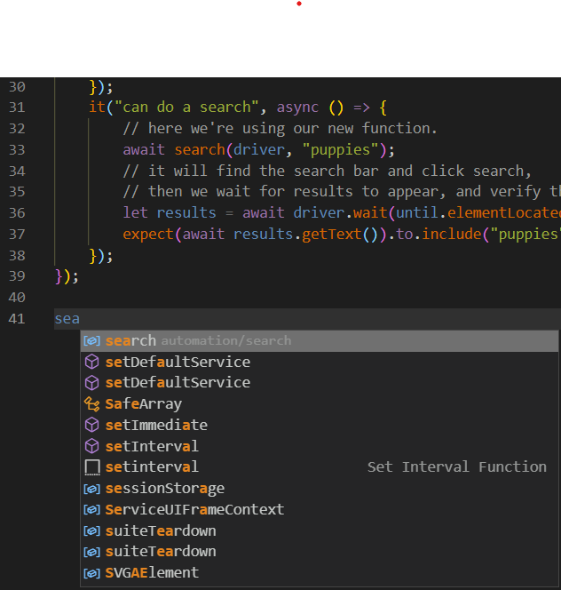

# Step 5: JavaScript Specific

[< Prev](./js4.md) | [General Step Instructions](../step5.md) | [Next >](./js6.md)

---

[TOC]

## Summary

Organizing your code into page objects, or just abstracting a function out to a different file is not going to be *too* different from the coding we've done so far.

### Abstracting Driver Creation

I created a simple file and function.

#### driverBuilder.js
```javascript
const { Builder} = require("selenium-webdriver");
require("chromedriver");
const driverBuilder = async () => {
    let driver = null;

    driver = await new Builder().forBrowser("chrome").build();

    return driver;
};

exports.driverBuilder = driverBuilder;
```
Note, all that happens here is that we declare the driver, and then return it. This might seem overly simple to have its own file/function. By itself, yeah, you're probably right.

Check out this slight tweak, however...

```javascript
const { Builder } = require("selenium-webdriver");
require("chromedriver");
require("geckodriver");
const driverBuilder = async (browserName) => {
    let driver = null;

    if (browserName === "firefox")
        driver = await new Builder().forBrowser("firefox").build();
    else driver = await new Builder().forBrowser("chrome").build();

    return driver;
};

exports.driverBuilder = driverBuilder;
```

While this means you need `geckodriver` installed (`npm i --save-dev geckodriver`) now whenever we use this function to ask for a driver, we can specify what browser we want back, but it will default to `chrome` unless `firexfox` is passed in specifically.

Implementing the new function is as simple as requiring it, then using it!

```javascript
const { driverBuilder } = require("./driverBuilder");
```

This will make the driverBuilder function available to any file where we add this line.

Follow that up with using it instead of the `Builder` in the test file, and you're good to go.

```javascript
before(async () => {
    driver = await driverBuilder();
    // if you want to see your test run in Firefox, use this instead:
    // driver = await driverBuilder("firefox"); 
    await driver.get("https://www.google.com");
});
```

For more detail about requiring/importing and exporting, read on!

* * *

### Abstracted Functionality Example

To pull out my search file was pretty darn straightforard.

>**Note:** This isn't a way to use a "page object", here we are just abstracting out the functionality to make it reusable. Often this is more efficient than the traditional Page Object Model.

#### `search.js`

You can create your file in the same directory -- since we're naming our tests `*.test.js` we can filter by name when running the tests so that Mocha doesn't try to run our functions as tests, or you can create a separate folder.

1. First, just cut and paste the function.
1. Check the function to see if you'll need to import anything in this separate file.
    * Since we are passing the function our driver, I don't need to require `Builder` in this file.
    * I will need to require `until` and `By`, since both are used by the search function, but not passed in.
1. Export the function. This was as simple as adding a line below the function:
    * `exports.search = search`
    * This makes the identifier `search` available for my other files to use, and then assigns the `search` function to it.

```javascript
// we need these, since they aren't passed into the function.
const { By, until } = require("selenium-webdriver");

// search = async function(driver, searchTerm){
const search = async (driver, searchTerm) => {
    let search = await driver.wait(until.elementLocated(By.name("q")));
    await search.sendKeys(searchTerm);

    // The button you see on login is hidden when you start typing, and
    // a new search button then appears. We need to find that one.
    // first, locate the element...
    let popoutSearchButton = await driver.wait(
        until.elementLocated(By.name("btnK"))
    );
    // now, wait for it to show up, then click.
    // (note: until.elementIsVisible needs an element, not a By)
    await driver.wait(until.elementIsVisible(popoutSearchButton)).click();
};
// this exports our search function as "search", and makes it available
// to other files.
exports.search = search;
```

#### firstTest.test.js

Requiring our search function isn't too hard to do. We just require the `search` property from `search.js`, and assign it to a constant in our test file.

* `const { search } = require("./search");`
    or
* `const search = require("./search").search;` the difference between this and the last has to do with object destructuring, if you want to google that!
    or
* `const search = require("./search");` if we change our export in `search.js` to `module.exports = search`

Still, I think the easiest way to import anything is to use the autocomplete in VS Code. Since we already set up the `export.search` in `search.js`, this is what shows up when I start typing `search` in `firstTest.test.js`...



From here I make sure the right suggestion is highlighted (as it is in in the screencap), and hit `Tab` on my keyboard. The appropriate code is auto-inserted into my requires up top!

```javascript
const { expect } = require("chai");
const { until, By } = require("selenium-webdriver");
// here is that driverBuilder we created before
const { driverBuilder } = require("./driverBuilder");
// here is our auto-required search -- but you can type this out manually too.
const { search } = require("./search");

describe("visiting google", () => {
    var driver;
    before(async () => {
        // this example uses Firefox
        driver = await driverBuilder("firefox");
        await driver.get("https://www.google.com");
    });
    after(async () => {
        await driver.quit();
    });
    it("shows 'Google' as the page title", async () => {
        expect(await driver.getTitle()).to.equal("Google");
    });
    it("waits for the search bar to show up", async () => {
        let search = driver.wait(until.elementLocated(By.name("q")));
        expect(await search.getTagName()).to.equal(
            "input",
            "The search bar should be an 'input'"
        );
    });
    it("can do a search", async () => {
        // here we're using our new function.
        await search(driver, "puppies");
        // it will find the search bar and click search,
        // then we wait for results to appear, and verify them
        let results = await driver.wait(until.elementLocated(By.id("search")));
        expect(await results.getText()).to.include("puppies");
    });
});
```

#### Some things to notice:

* Since my test was using the function named `search` and I imported the function to the constant `search`, I didn't need to tweak the tests themselves to still be able to use it -- I only needed to make sure to import it correctly.
* You can export more than one thing from a file. Want to make a `functions.js` file and export another function to handle navigating through the menu? Go for it! Your export might look something like:

```javascript
exports.search = search
exports.chooseMenuOption = chooseMenuOption
```

* Also, there are very few key words in JavaScript. Name your variables, functions, properties, etc. in a way that makes sense to you.


```javascript
// this would work, but it could get confusing.
const steve = (driver, searchTerm)=>{
    /* search function here */ 
}
exports.search = steve
```

* You'll see different coding examples using `export` and `import` statements sometimes when looking across the internet. These are "ES6" formatted statements, and can work with a little extra setup work to "transpile" your code. We're using `exports` and `require`, since these are "CommonJS" formatted statements and require no additional setup to work in our Node.js environment.

* * *

### Page Object Example

This example is a bit more complex. I chose not to create the driver in the page object itself, and to use a class for the page object -- but you might do differently... The model is very flexible.

Page objects can make collaboration cleaner and code more understandable in many cases. That increase in utility often comes at the cost of complexity -- it's easier to make a tool that meets one need well instead of a tool that fulfills half a dozen needs. It's up to you what you'd like to do.

#### SearchPage.js - the page object
```javascript
const { By, until } = require("selenium-webdriver");

// here we use the class syntax, though you could accomplish much the same with an object and properties.
class SearchPage {
    // these are the properties of our page
    driver;
    searchInput = By.name("q");
    searchButton = By.name("btnK");
    results = By.id("search");
    // classes use constructors to assign values on creation (our driver here)
    constructor(driver) {
        this.driver = driver;
    }
    // here are the methods that we have which are unique to the page
    async navigate() {
        await this.driver.get("https://www.google.com");
    }
    async getSearchBar() {
        return await this.driver.wait(until.elementLocated(this.searchInput));
    }
    async search(searchTerm) {
        let input = await this.getSearchBar();
        await input.sendKeys(searchTerm);
        return await this.driver
            .wait(
                until.elementIsVisible(
                    await this.driver.wait(
                        until.elementLocated(this.searchButton)
                    )
                )
            )
            .click();
    }
    async getResults() {
        return await this.driver
            .wait(until.elementLocated(this.results))
            .getText();
    }
}

exports.SearchPage = SearchPage;
```

Basically, you take all the things you might do on a page, and make methods for them, track locators, etc.

Then we import that into the test, and use it to control the page/get our information.

#### firstTest.test.js
```javascript
const { expect } = require("chai");
// I don't actually need Builder, until, or By any more; they're all used in other files, never here!
// const { Builder, until, By } = require("selenium-webdriver");
const { driverBuilder } = require("./driverBuilder");
// here is where I bring in my page object
const { SearchPage } = require("./SearchPage");

require("chromedriver");

describe("visiting google", () => {
    var driver;
    // the same logic applies to our page object as to the driver - declaring a variable out here makes it eaier to utilize.
    var page;
    before(async () => {
        driver = await driverBuilder();
        page = new SearchPage(driver);
        page.navigate();
    });
    after(async () => {
        // some people will put EVERYTHING on the page object... killing the page, etc. I don't feel is necessary to separate out.
        await driver.quit();
    });
    it("shows 'Google' as the page title", async () => {
        expect(await driver.getTitle()).to.equal("Google");
    });
    it("verify search bar", async () => {
        // since selectors should be part of the page object, I moved the functionality to wait for the element to the page object.
        let searchBar = await page.getSearchBar();
        expect(await searchBar.getTagName()).to.equal(
            "input",
            "The search bar should be an 'input'"
        );
    });
    it("can do a search", async () => {
        // here, we use the page object to search, then get the results we're checking.
        await page.search("puppies");
        expect(await page.getResults()).to.include("puppies");
    });
});
```

#### Some things to notice:
* Arguably, our tests could get easier to read in a complicated situation.
* It can get harder to organize/maintain your code as you get more and bigger pages.

* * *

## Tutorials/Docs

- [Node.js Modules (Node.js official)](https://nodejs.org/api/modules.html)
- [Understanding module.exports and exports in Node.js (Sitepoint)](https://www.sitepoint.com/understanding-module-exports-exports-node-js/)