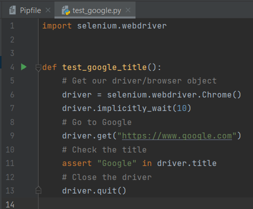
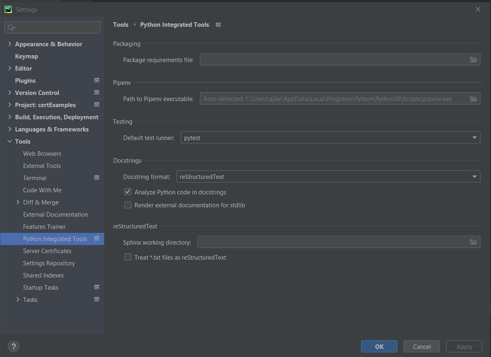
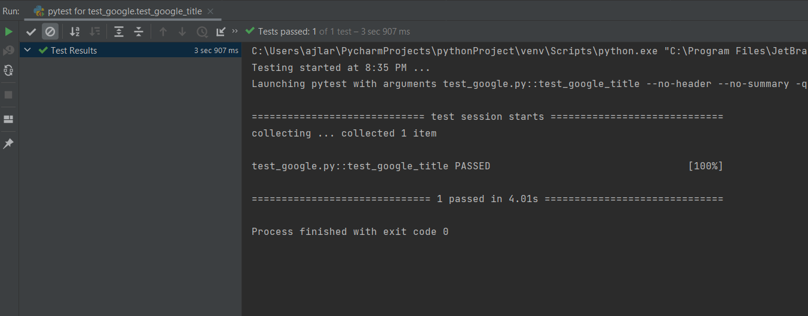

# Step 1: Python Specific

< Prev | [General Step Instructions](../step1.md) | [Next >](./p2.md)

---

[TOC]

## Summary

Python works a bit differently than other languages, but still isn't too hard to get going with. In fact, the instructions that follow will flow from a great tutorial on getting started written by Andy Knight, AKA The Automation Panda.

-   **Recommended IDE**: Pycharm or VS Code
-   **Environment**: pipenv
-   **Test Runner**: pytest
-   **Tutorial**:
    -   [TAU Videos](https://testautomationu.applitools.com/selenium-webdriver-python-tutorial)
    -   [Github Repo](https://github.com/AndyLPK247/tau-intro-selenium-py/tree/master)

## Environment Setup

There are already great instructions on getting started following Andy's course. That said, you don't need to clone his repo to get started.

Follow his instructions for Python and WebDriver setup. Roughly, it boils down to:

1. Install Python.
1. Setup for ChromeDriver.
    - Make sure you have any drivers you want to use downloaded and on your system's PATH.
1. Open up your IDE and your forked project. You can also clone the repository in via your IDE's version control functionality.
    - IDEs
        - Pycharm
        - VS Code
        - etc.
1. Install pipenv in the terminal: `pip install pipenv`
1. Create a new file in your project called `Pipfile`. You can copy and paste from below, but may need to tweak the python_version.

    ```python
    [[source]]
    name = "pypi"
    url = "https://pypi.org/simple"
    verify_ssl = true

    [dev-packages]

    [packages]
    pytest = "*"
    selenium = "*"

    [requires]
    python_version = "3.9"
    ```

1. Install dependencies and create your environment using pipenv: `pipenv install`
    - This creates a virtual environment with all dependencies where your project lives.
    - Set your Python interpreter as the pipenv virtual environment.
        - In VS Code, you may need to close/reopen to have the virtual environment as an option.

Now you're all set to get testing!

## Your First Test

1. Create a `tests` folder, or whatever you wish to call it.
1. Add a test file, I called mine `test_google.py`.
    - pytest finds test files by looking for a file like either of the following, where `*` can be replaced with the rest of the filename.
        - `*_test.py`
        - `test_*.py`
1. Open the file, and import WebDriver.
    ```python
    import selenium.webdriver
    ```
1. Add a function for a quick check of Google's title. We'll identify it as a test function by starting the name with `test_`

    ```python
    import selenium.webdriver


    def test_google_title():
        # Get our driver/browser object
        # Go to Google
        # Check the title
        # Close the driver

    ```

1. Setup your driver - you don't always need to tweak any waits, but I find it helpful to do so.

    ```python
    import selenium.webdriver


    def test_google_title():
        # Get our driver/browser object
        driver = selenium.webdriver.Chrome()
        driver.implicitly_wait(10)
        # Go to Google
        # Check the title
        # Close the driver

    ```

1. Now that web have a driver, we can get Google.

    ```python
    import selenium.webdriver


    def test_google_title():
        # Get our driver/browser object
        driver = selenium.webdriver.Chrome()
        driver.implicitly_wait(10)
        # Go to Google
        driver.get("https://www.google.com")
        # Check the title
        # Close the driver

    ```

1. Then check the title matches our expectations using `assert`, which we get from pytest.

    ```python
    import selenium.webdriver


    def test_google_title():
        # Get our driver/browser object
        driver = selenium.webdriver.Chrome()
        driver.implicitly_wait(10)
        # Go to Google
        driver.get("https://www.google.com")
        # Check the title
        assert "Google" in driver.title
        # Close the driver

    ```

1. And finally make sure we close the driver when we're done, so it doesn't sit and hold onto memory.

    ```python
    import selenium.webdriver


    def test_google_title():
        # Get our driver/browser object
        driver = selenium.webdriver.Chrome()
        driver.implicitly_wait(10)
        # Go to Google
        driver.get("https://www.google.com")
        # Check the title
        assert "Google" in driver.title
        # Close the driver
          driver.quit()

    ```

1. **Now we can run the test!**
    1. You can execute your tests with `pipenv run pytest`
        - pytest will now find your test file (and all others) and execute it (or them). It might take a moment, but you should eventulaly see a message like
    1. Even better, is `pipenv run python -m pytest tests`, which is a mouthful, or if you're in your pipenv shell, just `python -m pytest tests` -- this will be the best way to run your tests with page objects later.

            ```
            ==== 1 passed in 12.34s ====
            ```
    1. For one of test execution, you can also run your test by clicking the "play" button next to the test function definition.
        - 
        - If there is no button _or_ if the output says something like `process finished with exit code 0`, you may need to change your project's default test runner.
            1. Go to `File > Settings`
            1. Under `Tools > Python Integrated Tools` change your `Default test runner:` to `pytest`
                - 
            1. Try again.
        - 

Congrats! You now have a solid foundation to build from!

## Tutorials/Docs

-   [Official Docs: Selenium with Python](https://selenium-python.readthedocs.io/)
- [Full Pytest Selenium Tutorial by Automation Panda (TestProject)](https://blog.testproject.io/2019/07/16/python-test-automation-project-using-pytest/)
-   [Automation Panda: Python](https://automationpanda.com/python/)
-   [Assertions: pytest Docs](https://docs.pytest.org/en/6.2.x/assert.html#assert)
-   [Effective Python Testing With Pytest - Real Python](https://realpython.com/pytest-python-testing/)
- [pytest vs python -m pytest](https://docs.pytest.org/en/latest/explanation/pythonpath.html#pytest-vs-python-m-pytest)